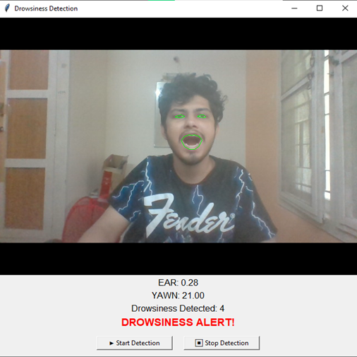
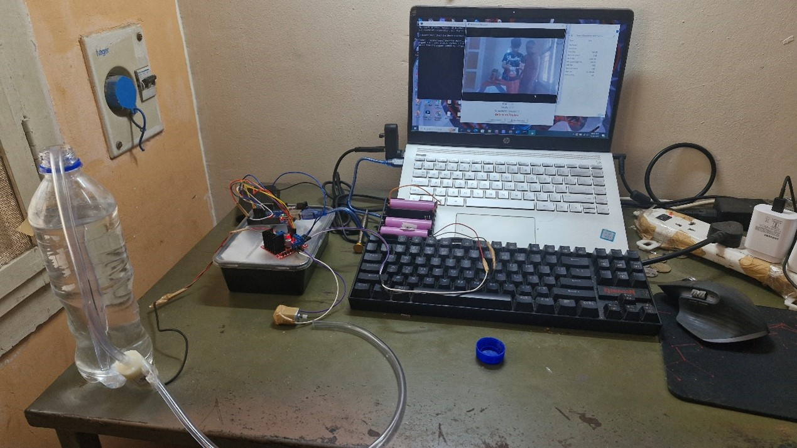
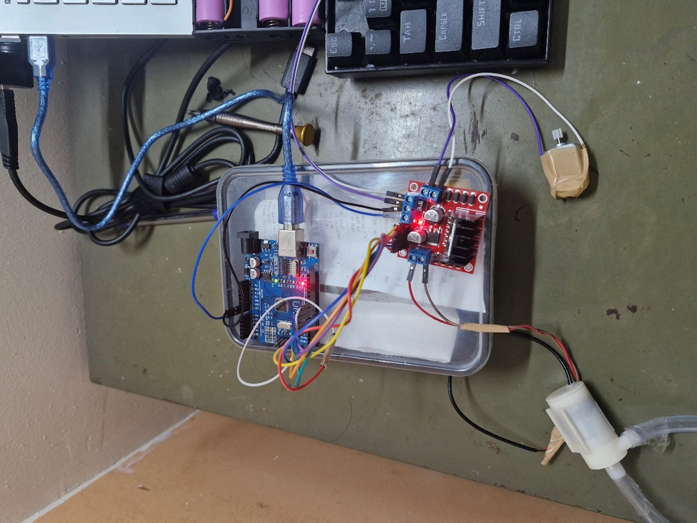
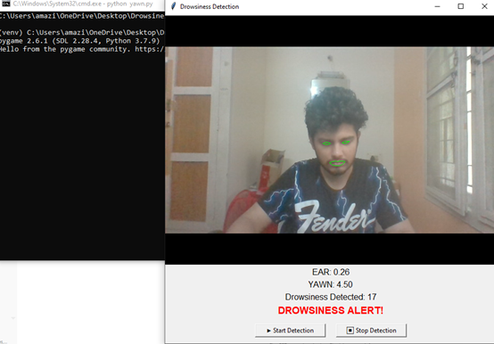
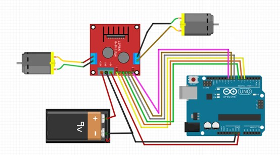
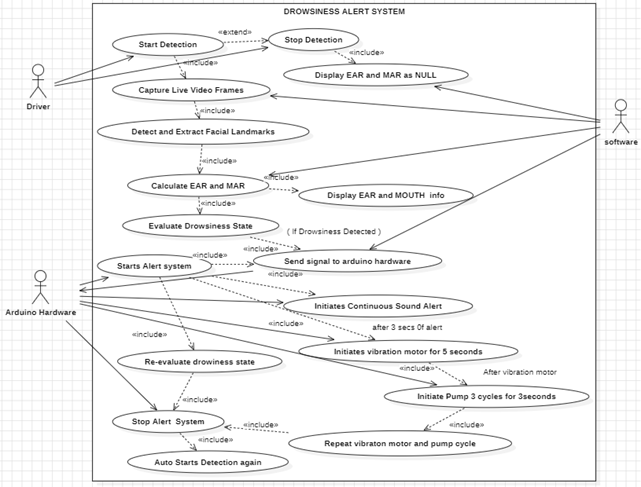

# 🛌💡 Drowsiness Alert System

A real-time drowsiness detection and alert system using computer vision and embedded hardware to prevent fatigue-related accidents.

---
## 📌 Features

- Real-time face, eye, and mouth landmark detection
- Calculates Eye Aspect Ratio (EAR) and Mouth Aspect Ratio (MAR)
- Detects prolonged eye closure and yawning
- Audio alerts via `pygame`
- Hardware alerts using:
  - Vibration motor
  - Water spray pump via Arduino Uno
- GUI dashboard with real-time EAR/MAR display and drowsiness count
- Start/Stop detection control

---

## 🛠️ Technologies Used

### 🧠 Software:
- **Python 3.7.9**
- **OpenCV** – Image processing and video capture
- **Dlib** – 68-point facial landmark detection
- **imutils** – Frame manipulation
- **NumPy & SciPy** – Mathematical calculations
- **pygame** – Audio alert playback
- **pyserial** – Serial communication with Arduino
- **Tkinter** – GUI Interface

### 🔧 Hardware:
- **Arduino Uno**
- **Vibration Motor**
- **Immersible Water Pump (5V)**
- **L298N Motor Driver**
- **Relay Module (for pump)**
- **Webcam**

## 📂 Project Directory Structure

```
Drowsiness Alert System/
│
├── screenshots/                      # 📸 Demo images & architecture diagrams
│   ├── circuit diagram.jpg           # 🔌 Circuit schematic
│   ├── Picture1.png - Picture4.png   # 🧑‍💻 Live detection snapshots
│   ├── Picture5.jpg - Picture6.jpg   # 🛠️ Hardware setup
│   └── usecase.png                   # 📊 Use Case Diagram
│
├── sketch_apr9a/                     # ⚙️ Arduino motor control code
│   └── sketch_apr9a.ino
│
├── venv/                             # 🐍 Virtual environment (ignored)
├── yawn.py                           # 🧠 Main Python detection script
├── shape_predictor_68_face_landmarks.dat  # 🎯 Dlib face landmark model
├── haarcascade_frontalface_default.xml    # 👁️ Haar cascade for face detection
├── Alert.wav                         # 🔊 Audio alarm
├── arduino_code.txt                  # 🔁 Serial command protocol reference
├── requirements.txt                  # 📦 Python dependencies
├── PROJECT REPORT.pdf                # 📘 Detailed report
├── LICENSE                           # ⚖️ License info
└── README.md                         # 📝 This file
```

---

## 🚀 How to Run

### 🔧 Installation

1. Clone the repo:
   ```
   git clone https://github.com/Shantanu10z/drowsiness-alert-system.git
   cd drowsiness-alert-system
   ```

2. Create a virtual environment:
   ```
   python -m venv venv
   venv\Scripts\activate   (on Windows)
   ```

3. Install dependencies:
   ```
   pip install -r requirements.txt
   ```

4. 🔄 Install dlib manually if needed:
   ```
   pip install .\dlib-19.22.99-cp37-cp37m-win_amd64.whl
   ```

---

## 🧠 How It Works

1. Live webcam captures facial frames.
2. Facial landmarks are extracted using Dlib.
3. EAR and MAR are calculated.
4. If EAR < 0.25 for 2+ seconds or MAR > 13, the system:
   - Plays an alarm sound
   - Sends a `start` signal to Arduino
5. Arduino triggers:
   - Vibration motor for 5 seconds
   - If unresponsive, water pump activates in 3x (3s ON / 3s OFF) cycles
6. When user wakes or stops detection, system sends a `stop` signal.


---

## 📷 Screenshots

| Detection Demo               | Hardware Setup            |
|-----------------------------|----------------------------|
|  |  |
|  |     |
|  |  |
|   |  |

---

## 🤝 Team Contributions

- **Shantanu Anand**: Full software and hardware development, GUI, integration, testing, report & poster creation
- **Rounak**: Assisted in facial detection setup and testing phases
- **Aryan**: Literature review, architecture diagrams, research documentation

---

## 📜 License

This project is licensed under the MIT License. See the [LICENSE](LICENSE) file for details.

---

## 🔗 Major References

- Zhang, Y., & Wang, J. (2022). Deep learning-based drowsiness detection. [Sensors](https://doi.org/10.3390/s22062069)
- Li, F., & Kumar, S. (2024). Facial landmarks for fatigue detection. [Sensors](https://doi.org/10.3390/s24077810)
- Nair, S., & Gupta, A. (2021). AI-based fatigue monitoring. [IJ Automotive Tech](https://doi.org/10.1016/j.ijaut.2021.1117)